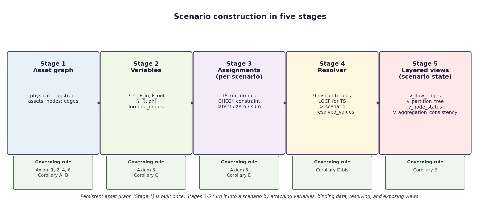

# Scenario Construction

How a scenario is built in the asset-centric framework, organised around the axioms and corollaries of `DESIGN_PRINCIPLES.md`. This is a focused reference: it walks through the construction sequence once, then names the axiom or corollary that governs each step.

A **scenario** is a coverage: the persistent asset graph plus a complete set of variable assignments that says, for every variable in the graph, which time series gives its value or which formula derives it.

---



*Figure 1 — Scenario construction sequence. Each stage is governed by one or more axioms and corollaries.*

---

## Stage 1 — The persistent asset graph

The first thing built is the asset graph. It is built once and does not change when data sources change.

**What gets defined**:

- **Physical assets** — refineries, pipelines, terminals, basins, gathering systems, storage hubs, foreign-supply boundary nodes, foreign-export-destination boundary nodes. Each is one row in `oil_network.assets` with `kind = 'physical'`.
- **Abstract assets** — observational aggregates (PADD views, basin views, refining-district views, the per-PADD stock-decomposition aggregates). Each is one row in `oil_network.assets` with `kind = 'abstract'`.
- **Nodes** — one row in `oil_network.nodes` per asset per graph. The starter scenario uses one graph (`graph_id = starter_us_crude`), so the assets-to-nodes correspondence is one-to-one. The design admits more graphs later — a per-grade view or a North American extension — without re-declaring the asset registry.
- **Edges** — directed flows between physical assets. Bidirectional pipelines (Capline, Seaway) and bidirectional terminals (SPR sites) are modelled as two separate directed edges, one per direction.

**Axioms and corollaries that govern this stage**:

- **Axiom 1** — every physical asset is a node.
- **Axiom 2** — the adjacency matrix is fixed across time; inactive edges carry zero flow rather than disappearing.
- **Axiom 4** — the persistent asset graph is separate from any scenario's state.
- **Axiom 6** — each direction of a reversible connection is its own directed edge.
- **Corollary A** — mass balance is committed at this stage to apply only at physical assets. Abstract aggregates inherit it through the aggregation formulas of Stage 2 rather than as a separate constraint.
- **Corollary B** — abstract assets have no flow edges; they exist only as aggregation views over the physical layer.

The result is a fixed structural superset. Every flow, every storage capacity, every potential observation site that the framework will ever need is present in the graph from day one.

---

## Stage 2 — Variables on each node

Every node carries one or more variables. A variable is the atomic unit of data attribution.

**What gets defined for each node**:

| Type | Symbol | Meaning |
|------|--------|---------|
| production | P | crude produced at this node (only on producing assets) |
| consumption | C | crude consumed at this node (only on consuming assets) |
| inflow | F_in | flow into this node from a specific related node |
| outflow | F_out | flow out of this node to a specific related node |
| inventory | S | stock held at this node |
| balancing_item | B | reporting residual (IEA convention) |
| phi | φ | cross-node alias reference (no flow, no stock) |

Inflow and outflow variables are *relational*: each carries a `related_node_id` pointing at the other end of the edge. A pipeline with one upstream feed and three downstream destinations has one inflow variable and three outflow variables.

For each variable a small structural declaration is made:

- **`formula_inputs`** lists other variables this one references. For an abstract-aggregate variable (`padd2_view.production`), `formula_inputs` lists the physical-asset variables it aggregates. For a TS-bound variable, `formula_inputs` carries the same list as a *constraint set* — the variables whose sum should equal the observed value.

**Axioms and corollaries**:

- **Axiom 3** — variables are the single source of truth. Everything else (edges, hierarchy, node status, partition closure) is a view computed from the variables collection.
- **Corollary A (materialised here)** — with variables now defined, the mass-balance equation `ΔS = P + ΣF_in − C − ΣF_out + B` becomes evaluable at each physical asset.
- **Corollary C** — geography metadata (PADD, state, county) is a labelling scheme, distinct from the resolution hierarchy that aggregation expresses through `formula_inputs`.

---

## Stage 3 — Per-scenario assignments

This is where a *scenario* actually comes into existence. The asset graph and the variables collection are scenario-agnostic; the assignments are not.

**What gets defined for each (variable, scenario, observation_date) tuple**:

```
INSERT INTO variable_assignments
  (variable_id, scenario_id, effective_from, timeseries_id, formula, formula_inputs)
VALUES (...);
```

For each variable in the scenario, exactly one of the following:

1. **TS-bound**: `timeseries_id` set, `formula` NULL. The variable's value comes from a published time series.
2. **Formula-bound**: `formula` set, `timeseries_id` NULL. The variable's value is computed at resolve time. Possible formulas include `'0'` (structural zero), `'latent()'` (unknown by design), `'sum'` (aggregate over `formula_inputs`), a bare variable_id (alias), or a signed arithmetic combination (e.g. `usa.P − padd1.P − padd2.P − ...`).

Both NULL is rejected. Both non-NULL is rejected.

**The CHECK constraint at the schema level**:

```sql
CHECK (num_nonnulls(timeseries_id, formula) = 1)
```

Together with the time-series attribution audit (one TS, one variable per scenario), this enforces single attribution of value at insert time — no double-counting can land in the assignments table.

**Latent vs zero**:

- `formula = '0'` means the framework asserts the variable is structurally zero (a pipeline's production, a gathering node's consumption).
- `formula = 'latent()'` means the variable exists structurally but its value is unknown by design — typically a per-edge flow at a junction where the per-route split is not publicly observable.

**Axioms and corollaries**:

- **Axiom 5** — observed XOR derived, enforced at the schema level.
- **Corollary D** — latent allocation at junctions: flows that are real but un-observable are declared latent rather than guessed.

---

## Stage 4 — The resolver

The resolver consumes the assignments and writes one row per (scenario, variable, observation_date) into `scenario_resolved_values`.

**Dispatch rules in priority order**:

1. **observed** — TS lookup. Last-observation-carried-forward between publication dates.
2. **zero** — `formula = '0'`. Value = 0.
3. **latent** — `formula = 'latent()'`. Value = NULL, source = `latent`.
4. **sum** — `formula = 'sum'`. Sum over `formula_inputs`.
5. **alias** — `formula = <bare variable_id>`. Inherit the named variable's value.
6. **reverse-mirror** — relational variable inherits its paired counterpart's value when the paired side resolves first.
7. **closure** — balancing item with mixed inputs in `formula_inputs`. `B = ΔS − P + C − ΣF_in + ΣF_out`.
8. **arithmetic** — signed combination (`A − B − C`). Evaluate.
9. **unresolved** — fall-through. Should be zero rows in a healthy run.

**Temporal convention** — when rule 1 looks up a TS at a date with no fresh observation, it carries the most recent prior value forward. Dates earlier than the first observation receive no row.

**Output table**:

```sql
CREATE TABLE scenario_resolved_values (
  scenario_id     TEXT NOT NULL,
  variable_id     TEXT NOT NULL,
  observation_date DATE NOT NULL,
  value           DOUBLE PRECISION,
  source          TEXT NOT NULL CHECK (source IN
                    ('observed', 'derived', 'zero', 'latent', 'partial', 'unresolved')),
  formula_used    TEXT,
  PRIMARY KEY (scenario_id, variable_id, observation_date)
);
```

The `formula_used` column records `locf(YYYY-MM-DD)` for carried-forward observations, so the audit trail distinguishes freshly published values from carried-over ones.

**Axioms and corollaries**:

- **Corollary D-bis** — LOCF is the temporal convention: a step function between observations, no interpolation.
- **Axiom 3** — every value in `scenario_resolved_values` is traceable to one source (TS, formula, structural zero, latent declaration).

---

## Stage 5 — Layered views and the scenario state

Once `scenario_resolved_values` is materialised, the scenario state is derived from it through a set of layered SQL views:

| View | Reads | Purpose |
|------|-------|---------|
| `v_flow_edges` | `variables` (relational rows) | Flow topology |
| `v_aggregation_edges` | `formula_inputs` on every assignment | Aggregation graph |
| `v_partition_tree` | `v_aggregation_edges` (same-type, same-related-node filter) | Partition spine for consistency claims |
| `v_node_status` | `variable_assignments` | Per (scenario, node) status: **authoritative**, **derived**, or **inactive** |
| `v_node_pcisob` | `scenario_resolved_values` | Per-node P/C/I/O/B/S/ΔS aggregates |
| `v_aggregation_consistency` | `v_partition_tree` + resolved values | Cross-check `\|TS_value − Σ children\|` |
| `v_node_balance_check` | `scenario_resolved_values` | Per-node mass-balance audit |
| `v_resolution_anomalies` | resolver output | Long LOCF runs, negative derived values, partition mismatches |

**Node status takes three values**:

- **authoritative** — at least one variable on the node is TS-bound.
- **derived** — no TS, but at least one variable resolves to a non-zero value via formula.
- **inactive** — every variable on the node is `'0'` or `'latent()'`.

A node's status follows mechanically from its variables' assignments under the scenario. There is no `nodes.status` column; the status is computed by the view each time it is read.

**Axioms and corollaries**:

- **Corollary E** — node status, like inflows / outflows / partition role / value aggregates, is materialised as a view rather than stored as a column. Any derivable property is computed once, in one place.

---

## Putting it together

A complete scenario is the tuple `(persistent asset graph, scenario_id, variable_assignments for that scenario_id)`. Construction follows the five stages above. The framework guarantees:

1. **Single attribution of value** at the schema level (Axiom 5 + CHECK constraint).
2. **Mass balance at every physical node** (Corollary A).
3. **Partition closure** across every aggregate that has constituents declared (cross-check via `v_aggregation_consistency`).
4. **No unresolved variables** in a healthy run (resolver dispatch rule 9 should fire zero times).
5. **Auditable temporal convention** (Corollary D-bis + the `formula_used` audit trail).

The same asset graph can carry any number of scenarios. The starter scenario `starter_us_crude_2015_2025` is the only one fully developed in the current implementation. A coarser companion (e.g. basin-only authoritative levels) is queued — and would exercise the cross-scenario consistency claim of Section 7.5 of the thesis.

---

## Quick reference — which axiom / corollary governs what

| Concern | Axiom or Corollary |
|---------|-------------------|
| Each physical asset is a node | Axiom 1 |
| Topology is fixed; inactive edges carry zero | Axiom 2 |
| Variables are the single source of truth | Axiom 3 |
| Persistent graph ≠ scenario state | Axiom 4 |
| Observed XOR derived (CHECK constraint) | Axiom 5 |
| Bidirectional flow ⇒ two directed edges | Axiom 6 |
| Mass balance at physical nodes | Corollary A |
| Abstract nodes have no flow edges | Corollary B |
| Geography labels ≠ resolution hierarchy | Corollary C |
| Latent allocation at junctions | Corollary D |
| Last-observation-carried-forward (LOCF) | Corollary D-bis |
| Node status is a view, not a column | Corollary E |

Read this alongside the full statements in `DESIGN_PRINCIPLES.md`.
